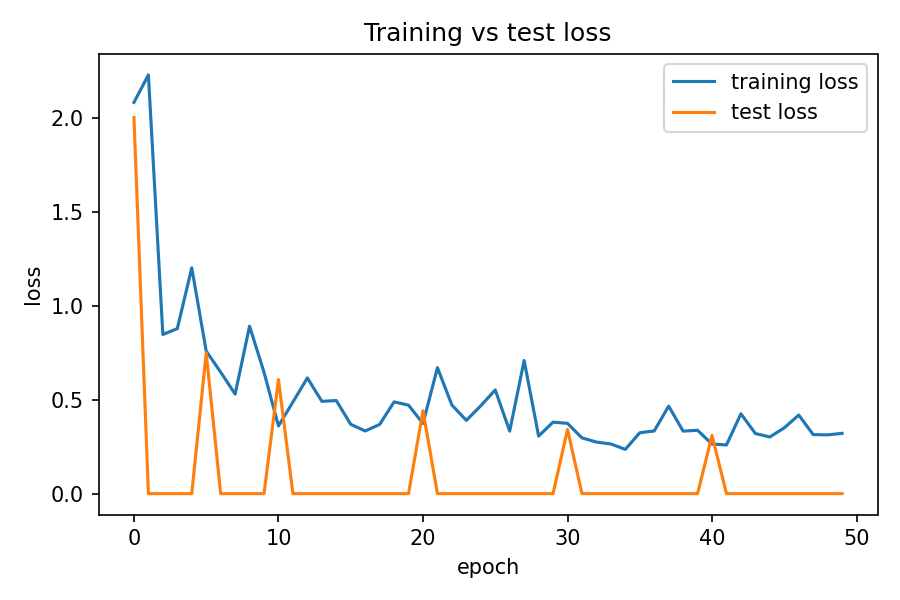
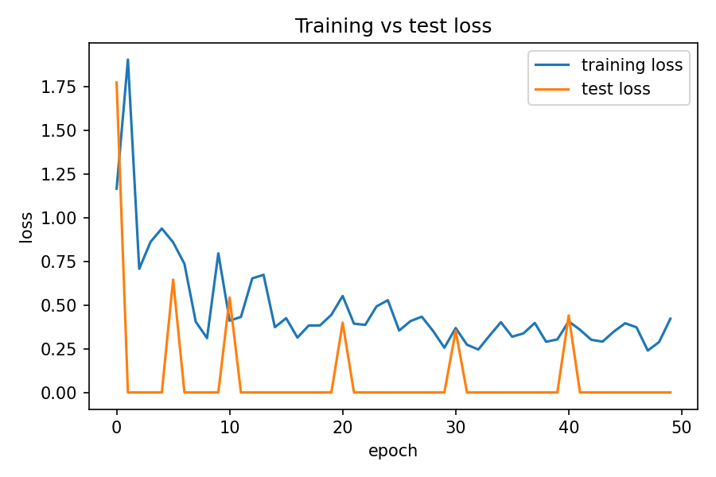

Currently, the pipeline segments quantitative phase imaging (QPI) maximum intensity projections (MIPs) — combining a fine-tuned **Cellpose** model for instance segmentation with a custom **U-Net** for multi-channel semantic segmentation.
## Overview

QPI MIP images are segmented in two complementary ways:

- **Cellpose** (fine-tuned) — instance segmentation, identifying individual cell instances within a QPI MIP image.
- **U-Net** — semantic segmentation into five channels: cell, nucleus, nucleolus, lipid droplet, and background.

The two outputs are combined into a per-cell mask, which then feeds into downstream phenotyping (alignment and feature extraction on `FINAL_MIPs` / `FINAL_MASKS`).

## Repository structure

```
├── README.md                  
├── environment.yml            <- conda environment spec
├── pyproject.toml
├── data_cleaning_pyfiles/     <- misc. data cleaning utilities
├── models/                    <- unet.py and unet_tests
├── qpi_seg/
│   ├── train/
│   │   ├── train_unet.py           <- train the U-Net
│   │   └── cellpose2d_train.py     <- fine-tune Cellpose
│   └── test/
│       ├── cellpose_test_napari_save.py  <- run Cellpose, edit in napari, save to CP_MASK/
│       ├── unet_test_save.py              <- run U-Net, save to UNET_MASK/
│       ├── save_combined_mask.py          <- combine per-cell masks into COMBINED_MASK/
│       └── run_napari_script.py           <- generic napari proofreading script
├── phenotyping/
│   └── align/                 <- alignment using FINAL_MIPs and FINAL_MASKS
└── runs/Unet/                 <- training run logs and outputs
```

> **Note:** file ordering is not guaranteed by `os.listdir` — always use `sorted(os.listdir(...))` when matching MIPs to masks.

## Inference scripts

| Script | Purpose |
|---|---|
| `predict_unseen.py` | Predict masks on new data using the trained U-Net |
| `cellpose_pretrained_eval.py` | Inference using the fine-tuned Cellpose model |
| `cellpose_eval.py` | Inference using the original (non-fine-tuned) Cellpose model |

You'll need two saved models to run inference:
1. **Cellpose (fine-tuned)** — trained on ~700 breast cancer MIPs
2. **U-Net** — [download link](https://livejohnshopkins-my.sharepoint.com/:u:/g/personal/agupt130_jh_edu/IQCuq4fhppjxRbd9RnAlhxV_ARqKCvYyAgTsh4ZhQGkvFV4?e=fHOBhD)

## Setup

```bash
git clone https://github.com/anoshqa/ARTEMIS2D
cd ARTEMIS2D
```

Create the environment from `environment.yml` (recommended — pulls in the exact versions we tested with, including PyTorch, Cellpose, and scikit-image):

```bash
conda env create -f environment.yml
conda activate artemis2d
```

Alternatively, for a manual/lightweight setup (e.g. CPU-only on Windows):

```bash
conda create -n artemis2d python=3.13
conda activate artemis2d
pip install torch torchvision   # CPU build if no local GPU
pip install cellpose
```

## Training loss

<p align="center">
  
  
</p>

## Acknowledgements

U-Net implementation adapted from [dl-janelia/unet](https://github.com/dl-janelia/unet/tree/19d9ba70acf047ada35954144cabb78284bbbcde).

## License

Released under the [MIT License](LICENSE).
